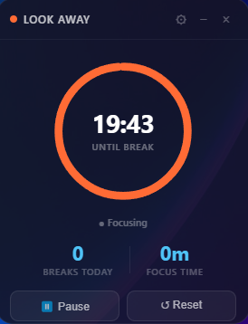
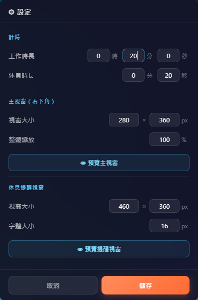

# LookAway 👁️

> **20-20-20 護眼法則** Windows 桌面小工具

每專注 **20 分鐘**,提醒你看 **20 呎**（約 6 公尺）外 **20 秒**,有效緩解長時間用眼疲勞。

---

## 畫面預覽

| Widget（常駐小工具） | Reminder（休息提醒） | Settings（設定） |
|:-:|:-:|:-:|
|  |  |  |

---

## 功能

- ⏰ **專注計時**：倒數到點自動彈出休息提醒，可暫停 / 重置
- 👁 **護眼休息**：休息倒數提醒看向遠方，可隨時跳過
- ⚙️ **可自訂**：工作 / 休息時長、視窗大小與整體縮放，並提供即時預覽
- 📊 **今日統計**：完成休息次數與累計專注時間
- 🔔 **常駐小工具**：停在螢幕右下角，可縮到系統匣
- 🔄 **自動更新**：安裝版開啟時自動檢查並更新

---

## 下載安裝（一般使用者）

到 **[Releases 頁面](https://github.com/frankkn/LookAway/releases/latest)** 下載,兩種版本擇一:

| 版本 | 檔名 | 說明 |
|------|------|------|
| **安裝版**（推薦） | `Look Away Setup x.x.x.exe` | 有安裝流程、開始選單捷徑、可解除安裝,**且支援自動更新** |
| **免安裝版** | `Look Away x.x.x.exe` | 下載後雙擊即用,適合隨身碟／試用（**不會自動更新**） |

> ⚠️ **SmartScreen 警告**：本程式未購買程式碼簽章憑證,首次執行 Windows 可能跳出「Windows 已保護您的電腦」。
> 點 **「其他資訊」→「仍要執行」** 即可。這是未簽章程式的正常現象,非病毒。

### 自動更新（僅安裝版）

安裝版每次開啟時會自動向 GitHub 檢查是否有新版:
- 有新版 → 背景下載 → 完成後跳出對話框,可選「立即重啟更新」或「稍後」。
- 也可從**系統匣圖示右鍵 →「檢查更新」**手動檢查。

---

## 技術棧

| 層次 | 技術 |
|------|------|
| 桌面容器 | Electron |
| 前端框架 | React + Vite |
| 樣式 | 純手寫 CSS（無 UI library） |
| 打包 | electron-builder（NSIS 安裝檔 + Portable exe） |
| 平台 | Windows only |

---

## 安裝與執行

### 開發模式

```powershell
npm install
npm run dev        # Vite dev server + Electron 熱更新
```

### 本機打包（不發布）

```powershell
npm run build      # → release/ 資料夾（安裝檔 + portable exe）
```

---

## 發版流程（維護者）

自動更新的來源是 GitHub Releases。

### 一次性設定（只做一次）

1. **建立 GitHub Token**：GitHub → Settings → Developer settings → Personal access tokens →
   **Tokens (classic)** → Generate,勾選 `repo` 權限,複製產生的 token（`ghp_…`）。
2. **設為永久環境變數**（之後發版就不用再輸入）：
   ```powershell
   [System.Environment]::SetEnvironmentVariable("GH_TOKEN", "ghp_你的token", "User")
   ```
   設完重開 PowerShell 生效。⚠️ 不要把 token 寫進程式碼或 commit。

### 每次發新版（三步）

```powershell
# 1. 改版本號（關鍵！沒往上加，使用者就不會收到更新）
npm version patch --no-git-tag-version      # 例：1.0.0 → 1.0.1

# 2. 打包並上傳到「草稿」Release
npm run release

# 3. 到 GitHub Releases 把草稿確認後按 Publish
```

> 只有正式 **Publish** 的 Release 才會觸發使用者更新；草稿（draft）與 pre-release 不會。

---

## 專案結構

```
src/
  main/
    index.js        # 主行程：計時狀態機、視窗管理、Tray、IPC
    preload.js      # contextBridge 安全橋接
  renderer/
    main.html / main.jsx          # Widget 進入點
    reminder.html / reminder.jsx  # Reminder 進入點
    components/
      Widget.jsx      # 主工具，依 phase 切換弧形 / 徽章 / 按鈕
      Reminder.jsx    # 「該休息了」對話窗
      ArcProgress.jsx # 共用 SVG 圓弧進度條
    styles/
      widget.css / reminder.css
vite.config.mjs       # 多頁 build；base: './'
electron-builder.yml  # Windows nsis + portable
```

---

## License

MIT
